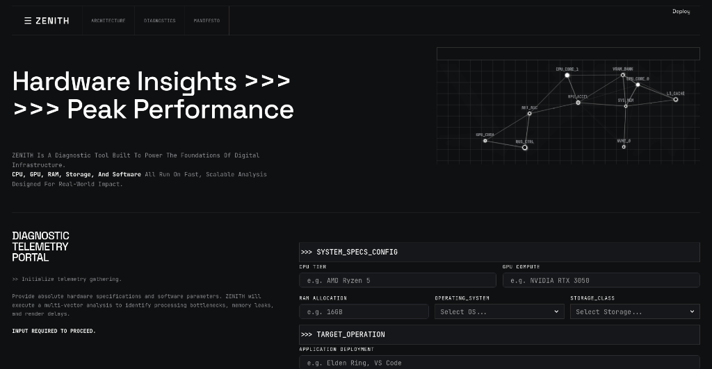
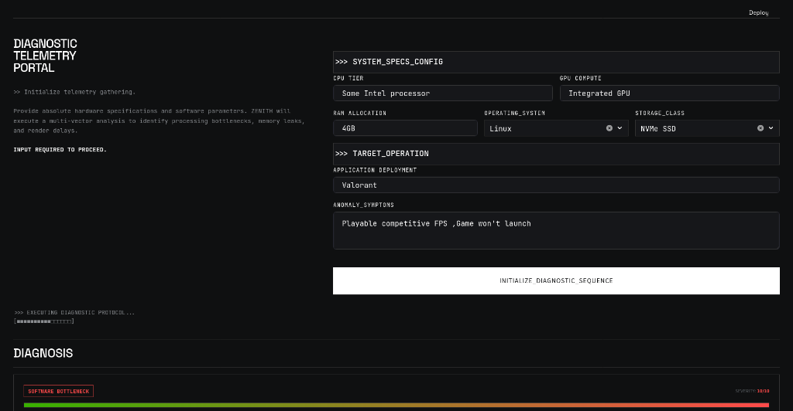
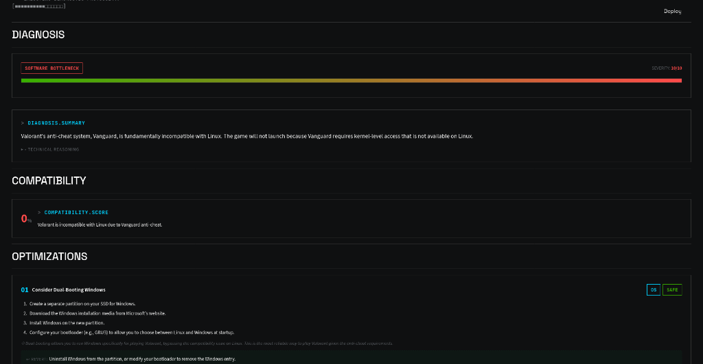

<p align="center">
  <strong>Z E N I T H</strong>
</p>

<p align="center">
  <em>AI-Powered System Performance Diagnostics</em>
</p>

<p align="center">
  
  
  
  
</p>

<p align="center">
  <a href="https://zenith--proto.streamlit.app/">
    
  </a>
</p>

---

**ZENITH** is an AI-powered diagnostic tool that acts as an autonomous performance analyst for your hardware. It uses Google's Gemini 2.0 Flash to identify bottlenecks, flag compatibility issues, and recommend safe, reversible optimization tweaks — all through a brutalist retro CLI interface.

<p align="center">
  
</p>

<p align="center">
  
</p>

<p align="center">
  
</p>

---

## Features

- **Bottleneck Detection** — Identifies CPU, GPU, RAM, I/O, thermal, and software bottlenecks with a severity score (1–10)
- **Compatibility Analysis** — Scores hardware/OS compatibility (0–100%) and explains why
- **Safe Optimizations** — Provides exactly 3 reversible tweaks with step-by-step instructions and terminal commands
- **Anti-Pattern Warnings** — Explicitly warns against dangerous actions (overclocking, registry hacks, etc.)
- **Cross-Platform** — Diagnoses Windows, Linux, and macOS systems

---

## Quick Start

### Prerequisites

- Python 3.11+
- A [Google Gemini API Key](https://aistudio.google.com/apikey)

### Installation

```bash
git clone https://github.com/yourusername/zenith.git
cd zenith

python -m venv .venv
source .venv/bin/activate    # Windows: .venv\Scripts\activate

pip install -r requirements.txt
```

### Configuration

```bash
cp .env.example .env
```

Edit `.env` and add your API key:

```env
GOOGLE_API_KEY=your_key_here
```

### Run

```bash
streamlit run app.py
```

Open `http://localhost:8501` in your browser.

---

## Architecture

ZENITH follows a strict **layered architecture** with clean separation of concerns:

```
zenith/
├── app.py                      # Controller — Streamlit entrypoint (presentation only)
├── config.py                   # Centralised app constants
├── ui_constants.py             # CSS theme + Gemini system prompt
├── requirements.txt
├── .env.example
│
├── domain/                     # Domain Layer — framework-free core
│   ├── models.py               #   Strict dataclasses (TelemetryInput, DiagnosticResponse, etc.)
│   └── exceptions.py           #   Custom exception hierarchy (ZenithException → ConfigurationError, etc.)
│
├── repository/                 # Repository Layer — data access only
│   └── gemini_client.py        #   Encapsulates Google Gemini SDK calls
│
├── service/                    # Service Layer — business logic
│   └── diagnostics_service.py  #   Validation, orchestration, domain model hydration
│
└── ui/                         # UI Layer — rendering
    ├── renderers.py            #   HTML-sanitized Streamlit renderers
    └── components.py           #   Embedded HTML/JS (hardware topology canvas)
```

### Data Flow

```
User Input → app.py (Controller)
                 ↓
         TelemetryInput (Domain Model)
                 ↓
     DiagnosticsService.run_diagnostics()
                 ↓
     GeminiDiagnosticsRepository.fetch_diagnosis()
                 ↓
          Gemini 2.0 Flash API
                 ↓
         Raw JSON → DiagnosticResponse.from_dict()
                 ↓
     render_full_results() → Streamlit UI
```

---

## Security

| Concern | Mitigation |
|---------|------------|
| **API Keys** | Environment variables only. Never hardcoded. `.gitignore` excludes `.env`. |
| **XSS** | All LLM output is sanitized via `html.escape()` before HTML injection. |
| **Supply Chain** | Only 2 runtime dependencies: `streamlit` and `google-genai`. |
| **Error Exposure** | Stack traces logged server-side only. Users see sanitized error codes. |
| **Input Validation** | Null guards on all user input. Type clamping on all parsed integers. |

---

## Tech Stack

| Component | Technology |
|-----------|------------|
| **Frontend** | Streamlit 1.35 |
| **AI Engine** | Google Gemini 2.0 Flash |
| **Language** | Python 3.11+ |
| **Styling** | Custom CSS (brutalist retro CLI aesthetic) |
| **Architecture** | Domain → Repository → Service → Controller |

---

## Environment Variables

| Variable | Required | Description |
|----------|----------|-------------|
| `GOOGLE_API_KEY` | ✅ | Google Gemini API key for diagnostic inference |

---

## License

Proprietary — All rights reserved unless otherwise specified.
